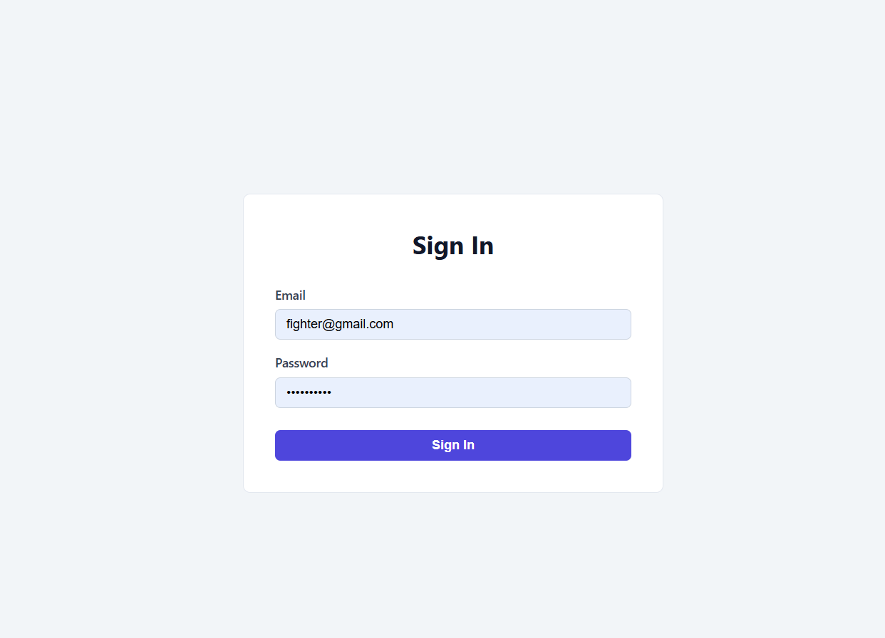
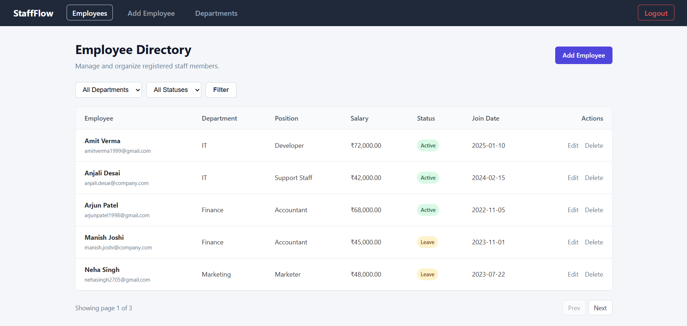
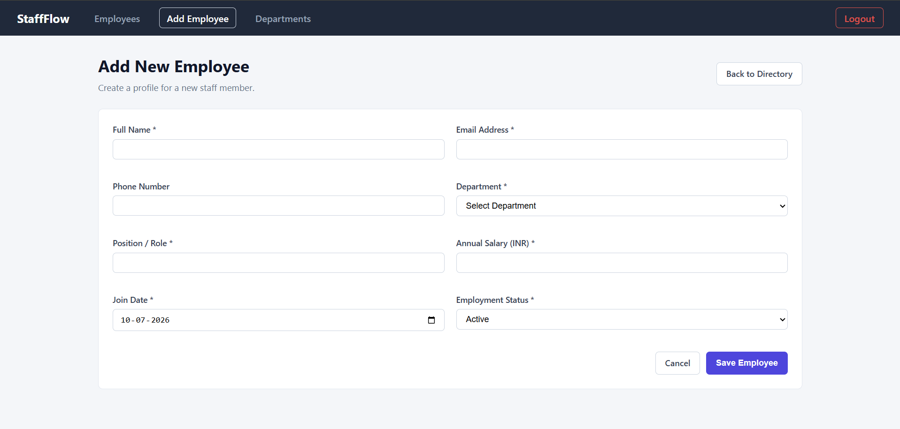
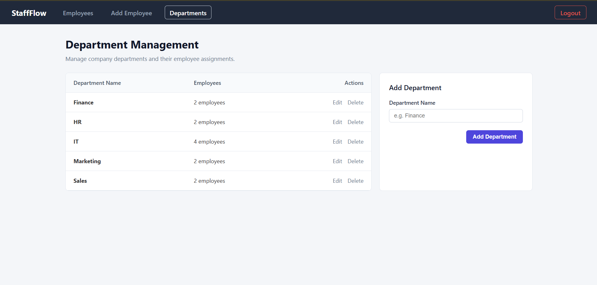
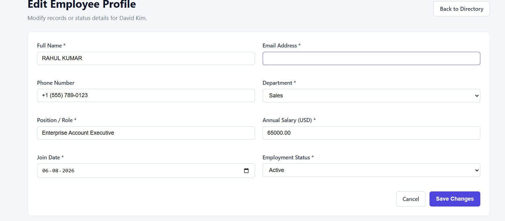

# 👨‍💼 StaffFlow - Employee Management System

<p align="center">
  
  
  
  
  
</p>

A modern **Employee Management System** built using **Node.js, Express.js, MySQL, HTML, CSS, JavaScript, and Bootstrap**. StaffFlow enables administrators to efficiently manage employees, departments, authentication, and employee records through a clean and responsive interface.

---

# 📖 Overview

StaffFlow is a CRUD-based web application designed for managing employees in an organization. It provides secure admin authentication, employee management, department management, and employee filtering, all connected to a MySQL database.

---

# ✨ Features

- 🔐 Secure Admin Login
- 👥 Employee Directory
- ➕ Add Employee
- ✏️ Edit Employee
- 🗑 Delete Employee
- 🏢 Department Management
- 📊 Employee Status Tracking
- 💰 Salary Management
- 📅 Join Date Management
- 🔍 Filter Employees by Department & Status
- 📱 Responsive UI
- 🗄 MySQL Database Integration

---

# 🛠 Tech Stack

| Technology | Purpose |
|------------|---------|
| Node.js | Backend Runtime |
| Express.js | Web Framework |
| MySQL | Database |
| HTML5 | Structure |
| CSS3 | Styling |
| JavaScript | Frontend Logic |
| Bootstrap | Responsive UI |

---

# 📂 Project Structure

```
StaffFlow/
│
├── config/
├── controllers/
├── middleware/
├── models/
├── routes/
├── public/
│   ├── css/
│   ├── js/
│   └── images/
│
├── views/
│
├── database/
│   └── staffflow.sql
│
├── app.js
├── package.json
└── README.md
```

---

# 📸 Screenshots

## 🔐 Login Page



---

## 👥 Employee Directory



---

## ➕ Add Employee



---

## 🏢 Department Management



---

## 🔄 Edit Employee's Profile



---

# ⚙ Installation

### 1. Clone Repository

```bash
git clone https://github.com/sumit-kumar-mahato-001/staffflow.git
```

---

### 2. Enter Project

```bash
cd staffflow
```

---

### 3. Install Dependencies

```bash
npm install
```

---

### 4. Create Database

```sql
CREATE DATABASE stafflow;
```

Import the SQL file:

```
database/staffflow.sql
```

---

### 5. Configure Database

Update your `.env`

```env
DB_HOST=localhost
DB_USER=root
DB_PASSWORD=yourpassword
DB_NAME=staffflow
PORT=5000
SESSION_SECRET=your_secret_key
```

---

### 6. Start Server

```bash
npm start
```

or

```bash
node app.js
```

---

Open

```
http://localhost:5000
```

---

# 🔑 Admin Login

```
Email:
fighter@gmail.com

Password:
fighter123
```

*(Change credentials in your database.)*

---

# 📋 Employee Module

- View Employees
- Add Employee
- Edit Employee
- Delete Employee
- Search Employees
- Filter by Department
- Filter by Status

---

# 🏢 Department Module

- Add Department
- Edit Department
- Delete Department
- View Employee Count

---

# 🗃 Database Tables

### Admin

- id
- email
- password

### Departments

- id
- name

### Employees

- id
- fullname
- email
- phone
- department_id
- position
- salary
- join_date
- status

---

# 🔄 Application Workflow

```
Admin Login
      │
      ▼
Authentication
      │
      ▼
Employee Dashboard
      │
 ┌────┼────┐
 ▼    ▼    ▼
Employees
Departments
Logout
      │
      ▼
Exit
```

---

# 🚀 Future Improvements

- JWT Authentication
- Profile Picture Upload
- Dashboard Analytics
- Employee Search
- Salary Reports
- Attendance Management
- Payroll Module
- Email Notifications
- Export PDF & Excel
- Dark Mode
- REST API

---

# 🤝 Contributing

Contributions are welcome.

1. Fork the repository
2. Create a new branch

```bash
git checkout -b feature-name
```

3. Commit your changes

```bash
git commit -m "Added new feature"
```

4. Push

```bash
git push origin feature-name
```

5. Open a Pull Request

---

# 📄 License

This project is licensed under the MIT License.

---

# 👨‍💻 Author

**Sumit Kumar Mahato**

Computer Science & Engineering Student

GitHub: https://github.com/sumit-kumar-mahato-001

---

⭐ If you like this project, don't forget to **Star** the repository.
